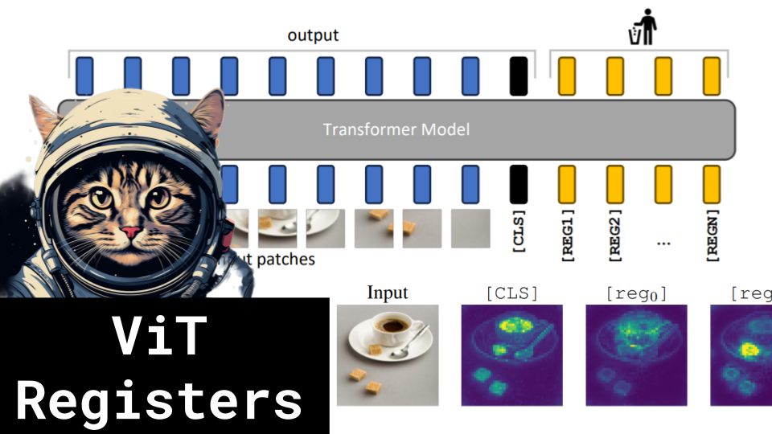

ViT Registers

Like 👍. Comment 💬. Subscribe 🟥.
🏘 Discord: https://discord.gg/pPAFwndTJd

**YouTube:** https://youtube.com/live/9kbSqIcc8uo

**X:** https://twitter.com/i/broadcasts/1LyxBnMXrLWxN

**Twitch:** https://www.twitch.tv/hu_po

# References

Arxiv paper
https://arxiv.org/pdf/2309.16588.pdf

DINO ViT
https://github.com/facebookresearch/dino/blob/main/vision_transformer.py

DINOv2 ViT
https://github.com/facebookresearch/dinov2/blob/main/dinov2/models/vision_transformer.py

DINOv2: Learning Robust Visual Features without Supervision
https://arxiv.org/pdf/2304.07193.pdf

ViT Diagram
https://raw.githubusercontent.com/google-research/vision_transformer/main/vit_figure.png

Localizing Objects with Self-Supervised Transformers and no Labels
https://arxiv.org/pdf/2109.14279.pdf

GPT investigates
https://chat.openai.com/share/d20dffbf-cb7e-4ec4-ad0f-e9d2f058b4f0

Vector Norms
https://mathworld.wolfram.com/VectorNorm.html

CPU Registers
https://media1.shmoop.com/shmooc/ap-computer-science/Computers_images/Computers3.png

DETR
https://arxiv.org/pdf/2005.12872.pdf

BERT
https://arxiv.org/pdf/1810.04805.pdf
