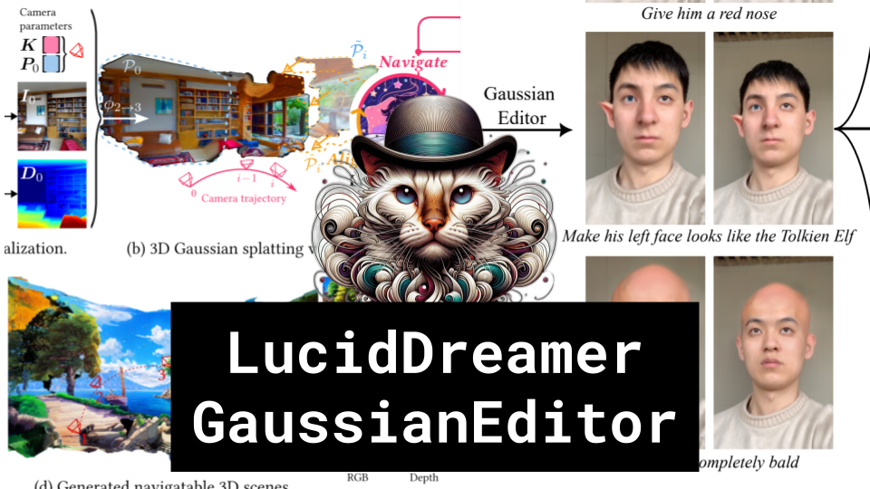

LucidDreamer, GaussianEditor

Like 👍. Comment 💬. Subscribe 🟥.
🏘 Discord: https://discord.gg/pPAFwndTJd

**YouTube:** https://youtube.com/live/IH6Ga5MQsIg

**X:** https://twitter.com/i/broadcasts/1lDxLPDpQZPxm

**Twitch:** https://www.twitch.tv/hu_po

# References

LucidDreamer: Domain-free Generation of 3D Gaussian Splatting Scenes
https://arxiv.org/pdf/2311.13384.pdf

GaussianEditor: Editing 3D Gaussians Delicately with Text Instructions
https://arxiv.org/pdf/2311.16037.pdf

GaussianDreamer: Fast Generation from Text to 3D Gaussian Splatting with Point Cloud Priors
https://arxiv.org/pdf/2310.08529.pdf

Control4D: Efficient 4D Portrait Editing with Text
https://control4darxiv.github.io/
