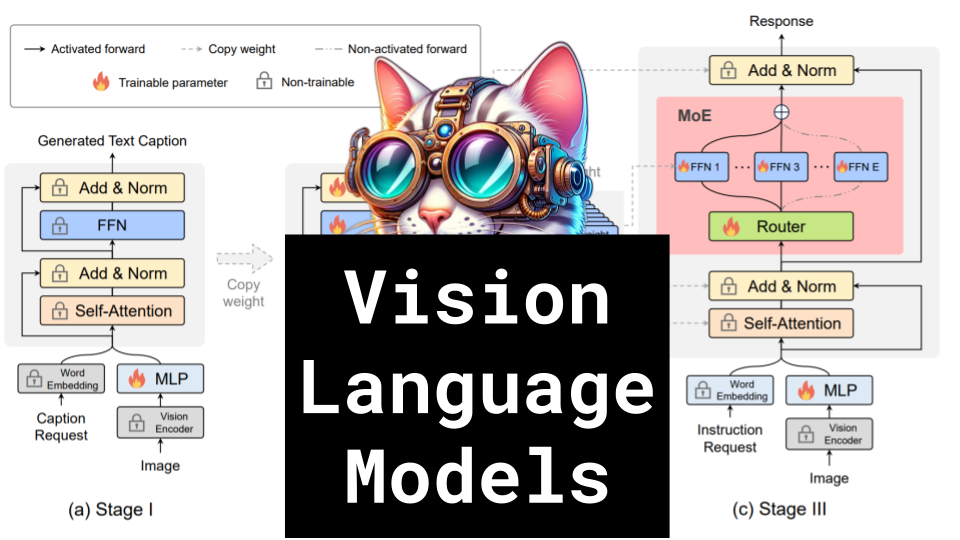

Vision Language Models: MoE-LLaVA, MOBILE-AGENT, and more

Like 👍. Comment 💬. Subscribe 🟥.
🏘 Discord: https://discord.gg/pPAFwndTJd

**YouTube:** https://youtube.com/live/uYb38g-weEY

**X:** https://twitter.com/i/broadcasts/1zqKVqkYELnxB

**Twitch:** https://www.twitch.tv/hu_po

# References

MoE-LLaVA: Mixture of Experts for Large Vision-Language Models
https://arxiv.org/pdf/2401.15947.pdf

InternLM-XComposer2: Mastering Free-form Text-Image Composition and Comprehension in Vision-Language Large Models
https://arxiv.org/pdf/2401.16420.pdf

MOBILE-AGENT: AUTONOMOUS MULTI-MODAL MOBILE DEVICE AGENT WITH VISUAL PERCEPTION
https://arxiv.org/pdf/2401.16158.pdf

Routers in Vision Mixture of Experts: An Empirical Study
https://arxiv.org/pdf/2401.15969.pdf

From GPT-4 to Gemini and Beyond: Assessing the Landscape of MLLMs on Generalizability, Trustworthiness, and Causality through Four Modalities
https://arxiv.org/pdf/2401.15071.pdf

LLaVA-1.6: Improved reasoning, OCR, and world knowledge
https://llava-vl.github.io/blog/2024-01-30-llava-1-6/

MouSi: Poly-Visual-Expert Vision-Language Models
https://arxiv.org/pdf/2401.17221.pdf