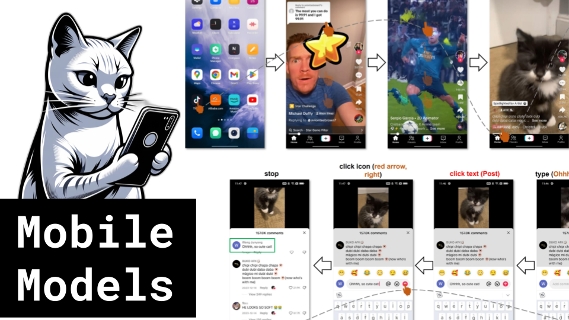

Mobile Models

Like 👍. Comment 💬. Subscribe 🟥.
🏘 Discord: https://discord.gg/pPAFwndTJd

**YouTube:** https://youtube.com/live/ufnL_bKsb6g

**X:** https://twitter.com/i/broadcasts/1ynKOyPEoXzJR

**Twitch:** https://www.twitch.tv/hu_po

# References

MOBILE-AGENT: AUTONOMOUS MULTI-MODAL MOBILE DEVICE AGENT WITH VISUAL PERCEPTION
https://arxiv.org/pdf/2401.16158.pdf

AppAgent: Multimodal Agents as Smartphone Users
https://arxiv.org/pdf/2312.13771.pdf

MobileDiffusion: Subsecond Text-to-Image Generation on Mobile Devices
https://arxiv.org/pdf/2311.16567.pdf

MobileSAMv2: Faster Segment Anything to Everything
https://arxiv.org/pdf/2312.09579.pdf

https://github.com/ChaoningZhang/MobileSAM

Mobile V-MoEs: Scaling Down Vision Transformers via Sparse Mixture-of-Experts
https://arxiv.org/pdf/2309.04354.pdf

Efficient Hybrid Zoom using Camera Fusion on Mobile Phones
https://arxiv.org/pdf/2401.01461.pdf
