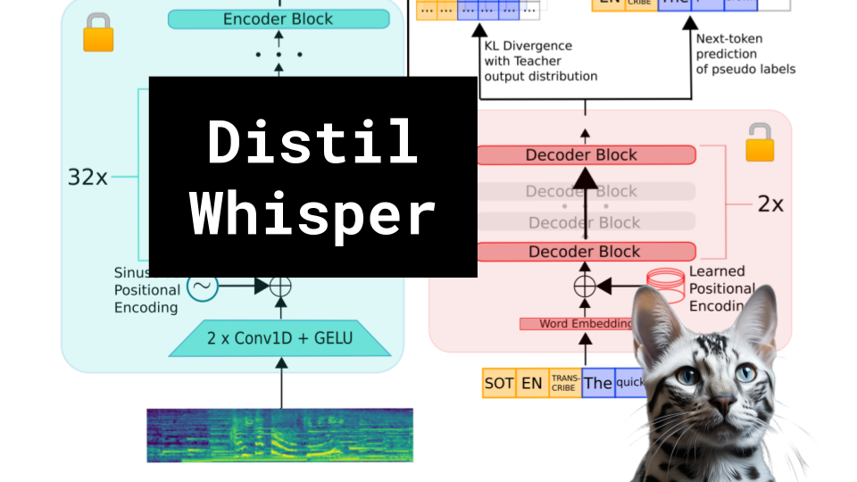

DISTIL-WHISPER

Like 👍. Comment 💬. Subscribe 🟥.
🏘 Discord: https://discord.gg/pPAFwndTJd

**YouTube:** https://youtube.com/live/kI1pA1CADxM

**X:** https://twitter.com/i/broadcasts/1zqKVqwrmzPxB

**Twitch:** https://www.twitch.tv/hu_po

# References

DISTIL-WHISPER: ROBUST KNOWLEDGE DISTILLATION VIA LARGE-SCALE PSEUDO LABELLING
https://arxiv.org/pdf/2311.00430.pdf

Low-latency Real-time Voice Conversion on CPU
https://arxiv.org/abs/2311.00873.pdf

Distil Colab
https://colab.research.google.com/github/sanchit-gandhi/notebooks/blob/main/Distil_Whisper_Benchmark.ipynb

Assisted Generation
https://huggingface.co/blog/assisted-generation

Mel Spectogram
https://towardsdatascience.com/getting-to-know-the-mel-spectrogram-31bca3e2d9d0
https://miro.medium.com/v2/resize:fit:1400/format:webp/1*xTYCtcx_7otHVu-uToI9dA.png
https://miro.medium.com/v2/resize:fit:1400/format:webp/1*tIBRdtG3EfjmSIlraWVIxw.png

Fast Inference from Transformers via Speculative Decoding
https://arxiv.org/pdf/2211.17192.pdf

Robust Speech Recognition via Large-Scale Weak Supervision
https://arxiv.org/pdf/2212.04356.pdf
