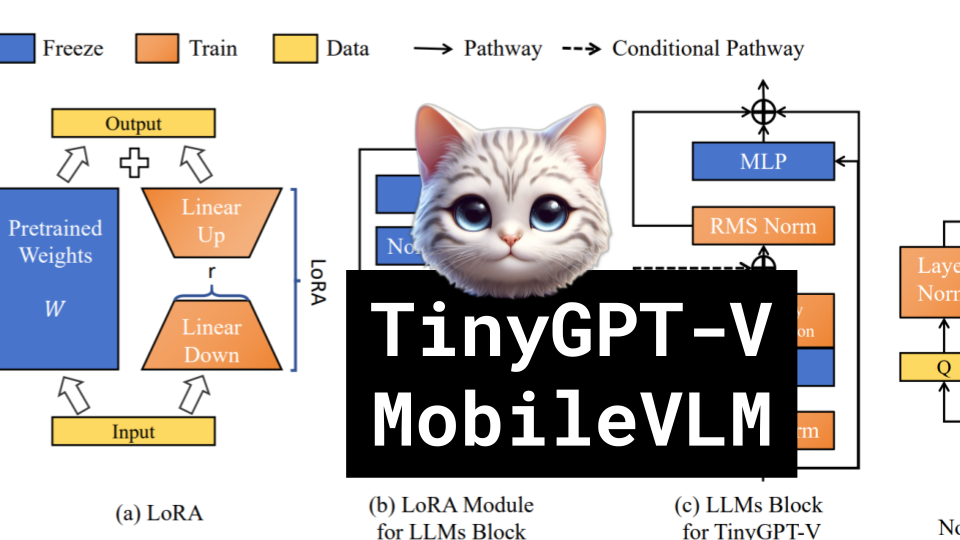

TinyGPT-V, MobileVLM

Like 👍. Comment 💬. Subscribe 🟥.
🏘 Discord: https://discord.gg/pPAFwndTJd

**YouTube:** https://youtube.com/live/gfRHoqdZqxw

**X:** https://twitter.com/i/broadcasts/1ZkJzjQNPWoJv

**Twitch:** https://www.twitch.tv/hu_po

# References

MobileVLM: A Fast, Strong and Open Vision Language Assistant for Mobile Devices
https://arxiv.org/pdf/2312.16886.pdf

TinyGPT-V: Efficient Multimodal Large Language Model via Small Backbones
https://arxiv.org/pdf/2312.16862v1.pdf

GPT-4V(ision) is a Generalist Web Agent, if Grounded
https://arxiv.org/pdf/2401.01614.pdf

COSMO: COntrastive Streamlined MultimOdal Model with Interleaved Pre-Training
https://arxiv.org/pdf/2401.00849.pdf

ViT diagram
https://gowrishankar.info/blog/transformers-everywhere-patch-encoding-technique-for-vision-transformersvit-explained/architecture.png

