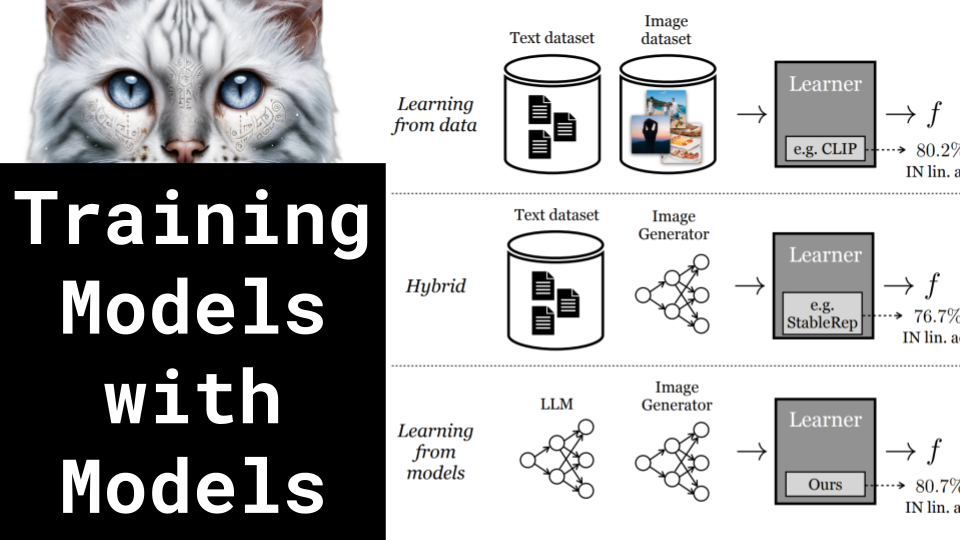

Training Models with Models

Like 👍. Comment 💬. Subscribe 🟥.
🏘 Discord: https://discord.gg/pPAFwndTJd

**YouTube:** https://youtube.com/live/MWdZhZPj7co

**X:** https://twitter.com/i/broadcasts/1OyKAWqpONyJb

**Twitch:** https://www.twitch.tv/hu_po

# References

Reinforced Self-Training (ReST) for Language Modeling
https://arxiv.org/pdf/2308.08998.pdf

Beyond Human Data: Scaling Self-Training for Problem-Solving with Language Models
https://arxiv.org/pdf/2312.06585.pdf

Self-Play Fine-Tuning Converts Weak Language Models to Strong Language Models
https://arxiv.org/pdf/2401.01335v1.pdf

Learning Vision from Models Rivals Learning Vision from Data
https://arxiv.org/abs/2312.17742.pdf

Improving Text Embeddings with Large Language Models
https://arxiv.org/pdf/2401.00368.pdf

Cross Entropy Loss
https://youtu.be/ErfnhcEV1O8?si=O_AFYFsVPKzis1qb&t=456

Marginal Distributions
https://i.stack.imgur.com/gASmT.png
https://image1.slideserve.com/3014178/marginal-distributions-l.jpg

Phi-2 is MIT but trained on GPT-4 synthetic data?
https://x.com/SebastienBubeck/status/1743519400626643359?s=20
https://www.microsoft.com/en-us/research/publication/textbooks-are-all-you-need/

