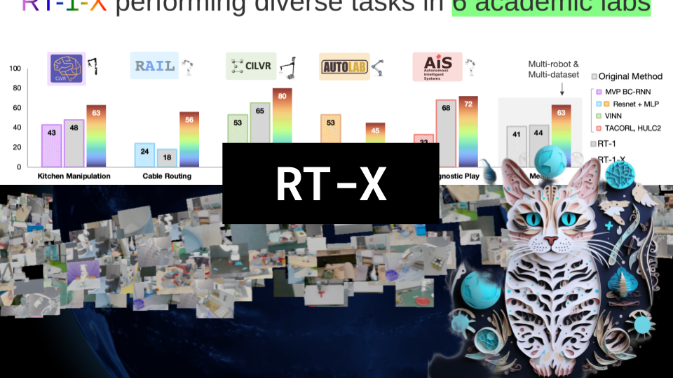

RT-X

Like 👍. Comment 💬. Subscribe 🟥.
🏘 Discord: https://discord.gg/pPAFwndTJd

**YouTube:** https://youtube.com/live/BV66stx-LGc

**X:** https://twitter.com/i/broadcasts/1eaKbgdeAYZGX

**Twitch:** https://www.twitch.tv/hu_po

# References

Paper
https://robotics-transformer-x.github.io/paper.pdf

Blogpost
https://www.deepmind.com/blog/scaling-up-learning-across-many-different-robot-types

GitHub page
https://robotics-transformer-x.github.io/

Dataset, Train, and Eval Notebooks
https://console.cloud.google.com/storage/browser/gresearch/robotics/open_x_embodiment_and_rt_x_oss;tab=objects?prefix=&forceOnObjectsSortingFiltering=false

Dataset info
https://docs.google.com/spreadsheets/d/1rPBD77tk60AEIGZrGSODwyyzs5FgCU9Uz3h-3_t2A9g
