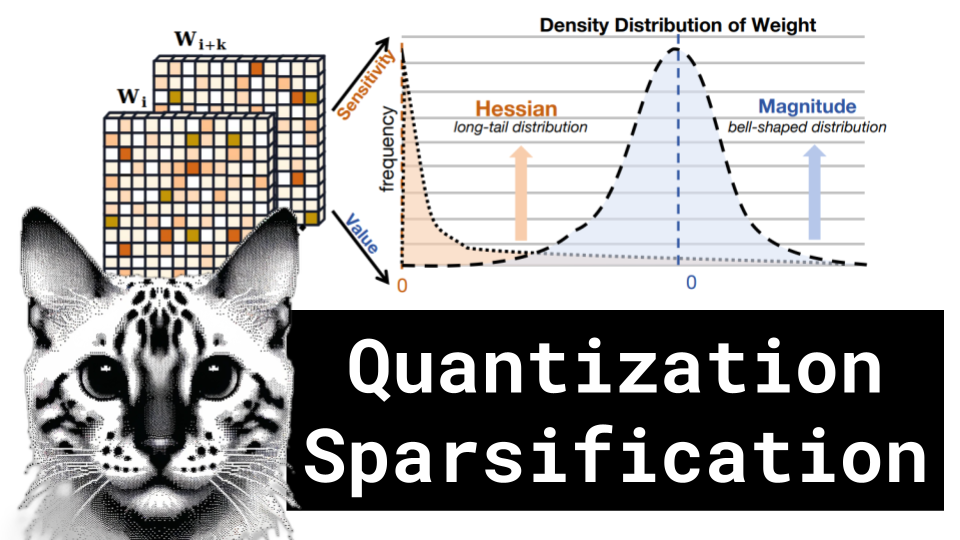

Quantization Sparsification

Like 👍. Comment 💬. Subscribe 🟥.
🏘 Discord: https://discord.gg/pPAFwndTJd

**YouTube:** https://youtube.com/live/QdqYFkeiGnw

**X:** https://twitter.com/i/broadcasts/1OyJAWlByzLKb

**Twitch:** https://www.twitch.tv/hu_po

# References

BiLLM: Pushing the Limit of Post-Training Quantization for LLMs
https://arxiv.org/pdf/2402.04291.pdf

SLICEGPT: COMPRESS LARGE LANGUAGE MODELS BY DELETING ROWS AND COLUMNS
https://arxiv.org/pdf/2401.15024.pdf

Datatypes visualization
https://en.wikipedia.org/wiki/Bfloat16_floating-point_format

Hessian Matrix
https://en.wikipedia.org/wiki/Hessian_matrix

Optimal Brain Damage
https://proceedings.neurips.cc/paper_files/paper/1989/file/6c9882bbac1c7093bd25041881277658-Paper.pdf

Optimal Brain Compression: A Framework for Accurate Post-Training Quantization and Pruning
https://arxiv.org/pdf/2208.11580.pdf

Optimal Brain Surgeon and General Network Pruning
https://www.babak.caltech.edu/pubs/conferences/00298572.pdf

LLM visualization
https://bbycroft.net/llm
