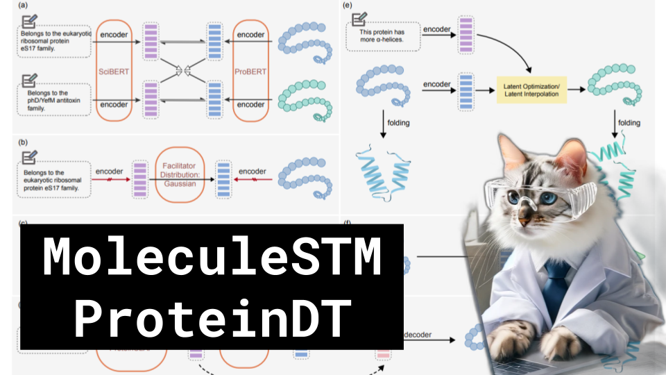

MoleculeSTM ProteinDT

Like 👍. Comment 💬. Subscribe 🟥.
🏘 Discord: https://discord.gg/pPAFwndTJd

**YouTube:** https://youtube.com/live/ftMJYZKkaV8

**X:** https://twitter.com/i/broadcasts/1rmxPMpmmgQKN

**Twitch:** https://www.twitch.tv/hu_po

# References

Multi-modal Molecule Structure-text Model for Text-based Retrieval and Editing
https://arxiv.org/pdf/2212.10789.pdf

A Text-guided Protein Design Framework
https://arxiv.org/pdf/2302.04611.pdf

ESM2 Metagenomic Atlas
https://esmatlas.com/about#explore_the_esm_metagenomic_atlas

How many proteins
https://lh3.googleusercontent.com/pvN40nLfZI2M9iHd9MFPEb2v69Zuevb3R4NGCjZSMpW4VgbbxSwmQBdWvUW-U8s4lyHCdHqa-1R4NmuXNAZ5YfmaKFuKpqMtCnWedH7EGKpP1Oub=w2140-rw
