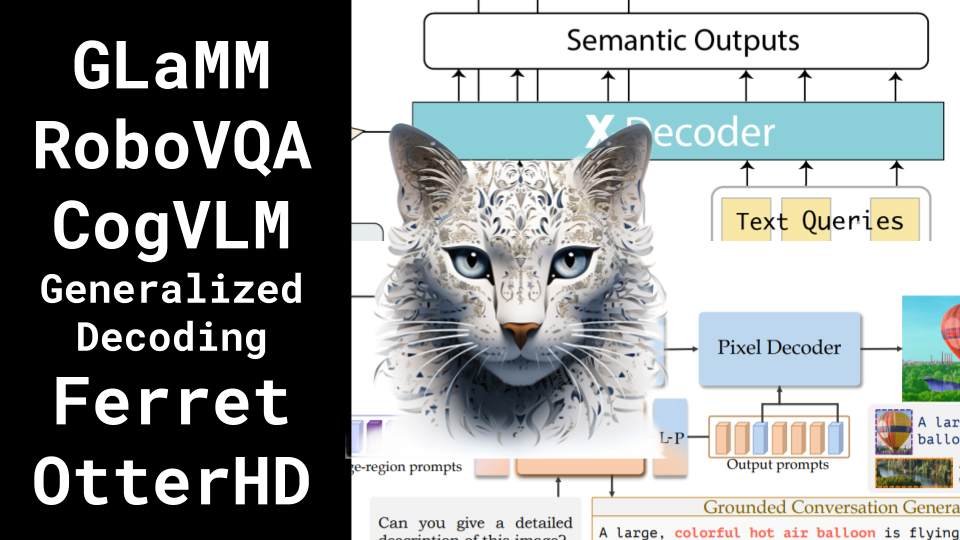

CogVLM, RoboVQA, GLaMM, and more!

Like 👍. Comment 💬. Subscribe 🟥.
🏘 Discord: https://discord.gg/pPAFwndTJd

**YouTube:** https://youtube.com/live/QvVEHFcT2pE

**X:** https://twitter.com/i/broadcasts/1mnGepBDkvLKX

**Twitch:** https://www.twitch.tv/hu_po

# References

LLAVA-PLUS: LEARNING TO USE TOOLS FOR CREATING MULTIMODAL AGENTS
https://arxiv.org/pdf/2311.05437.pdf

FERRET: REFER AND GROUND ANYTHING ANYWHERE AT ANY GRANULARITY
https://arxiv.org/pdf/2310.07704.pdf

Generalized Decoding for Pixel, Image, and Language
https://arxiv.org/pdf/2212.11270.pdf
https://x-decoder-vl.github.io/
https://github.com/UX-Decoder/Segment-Everything-Everywhere-All-At-Once

LLaVA-Interactive: An All-in-One Demo for Image Chat, Segmentation, Generation and Editing
https://arxiv.org/pdf/2311.00571.pdf

Large Language Models are Temporal and Causal Reasoners for Video Question Answering
https://arxiv.org/pdf/2310.15747.pdf

RoboVQA: Multimodal Long-Horizon Reasoning for Robotics
https://arxiv.org/pdf/2311.00899.pdf

COGVLM: VISUAL EXPERT FOR LARGE LANGUAGEMODELS
https://arxiv.org/pdf/2311.03079v1.pdf
https://github.com/THUDM/CogVLM

OtterHD: A High-Resolution Multi-modality Model
https://arxiv.org/pdf/2311.04219.pdf

GLaMM : Pixel Grounding Large Multimodal Model
https://arxiv.org/pdf/2311.03356.pdf

Terminology Vote
https://twitter.com/giffmana/status/1719811524271755562
