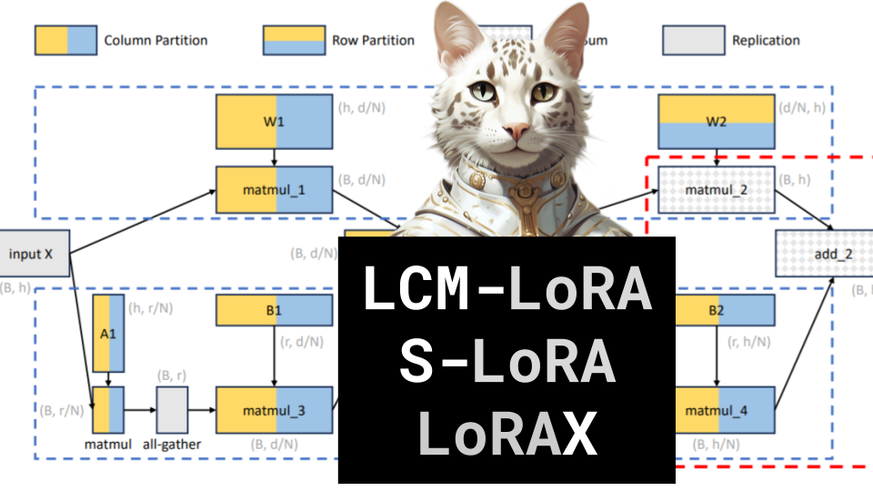

LCM-LoRA, S-LoRA, LoRAX

Like 👍. Comment 💬. Subscribe 🟥.
🏘 Discord: https://discord.gg/pPAFwndTJd

**YouTube:** https://youtube.com/live/G7FnlVYRUuY

**X:** https://twitter.com/i/broadcasts/1vOGwjwzglMKB

**Twitch:** https://www.twitch.tv/hu_po

# References

LCM-LORA: A UNIVERSAL STABLE-DIFFUSION ACCELERATION MODULE
https://arxiv.org/pdf/2311.05556.pdf

S-LORA: SERVING THOUSANDS OF CONCURRENT LORA ADAPTERS
https://arxiv.org/pdf/2311.03285.pdf

https://machinelearningmastery.com/fast-and-cheap-fine-tuned-llm-inference-with-lora-exchange-lorax/
https://youtu.be/bS3eqrd5r3k?si=tARuk4md_DIfUJdD

LoRA Articles
https://huggingface.co/docs/peft/conceptual_guides/lora#common-lora-parameters-in-peft
https://xiaosean5408.medium.com/fine-tuning-llms-made-easy-with-lora-and-generative-ai-stable-diffusion-lora-39ff27480fda
https://huggingface.co/docs/diffusers/main/en/training/lora
