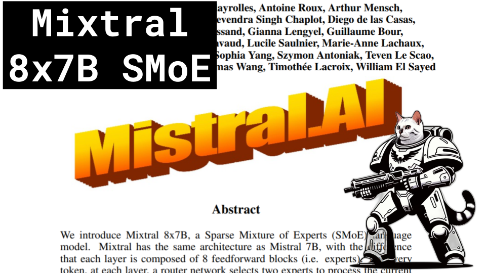

Mixtral SMoE

Like 👍. Comment 💬. Subscribe 🟥.
🏘 Discord: https://discord.gg/pPAFwndTJd

**YouTube:** https://youtube.com/live/9CudVyOY6-Q

**X:** https://twitter.com/i/broadcasts/1vOGwjDlXjbKB

**Twitch:** https://www.twitch.tv/hu_po

# References

Mixtral of Experts
https://arxiv.org/pdf/2401.04088.pdf

Mistral 7B
https://arxiv.org/pdf/2310.06825.pdf

Grouped Query Attention
https://klu.ai/_next/image?url=%2F_next%2Fstatic%2Fmedia%2Fwhat-is-grouped-query-attention-gqa.32669ace.png

Mistral the company
https://mistral.ai/company/

Visualizing an LLM
https://bbycroft.net/llm

Fast Inference of Mixture-of-Experts Language Models with Offloading
https://arxiv.org/pdf/2312.17238v1.pdf

MoE-Mamba: Efficient Selective State Space Models with Mixture of Experts
https://arxiv.org/pdf/2401.04081

Perplexity Values 20k vs 8
https://www.perplexity.ai/search/explain-perplexity-as-Jenq7WDWRiqT_FwX0nvalg?s=c#ff24486a-6170-435a-a607-abb4e4fea9a9

Mixtral Explained
https://youtu.be/UiX8K-xBUpE

