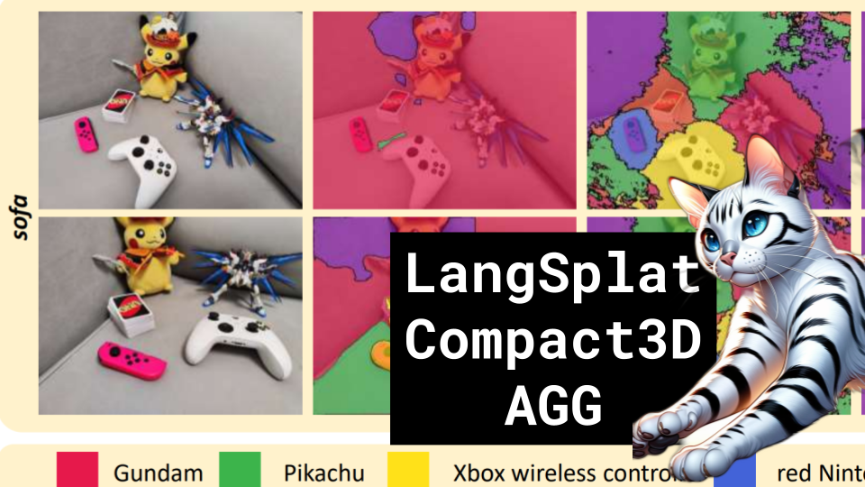

LangSplat, Compact3D, Spacetime Gaussians

Like 👍. Comment 💬. Subscribe 🟥.
🏘 Discord: https://discord.gg/pPAFwndTJd

**YouTube:** https://youtube.com/live/CTMdM4svUlg

**X:** https://twitter.com/i/broadcasts/1DXGyjbzvaEJM

**Twitch:** https://www.twitch.tv/hu_po

# References

Compact3D: Compressing Gaussian Splat Radiance Field Models with Vector Quantization
https://arxiv.org/abs/2311.18159.pdf

Spacetime Gaussian Feature Splatting for Real-Time Dynamic View Synthesis
https://arxiv.org/pdf/2312.16812.pdf

LangSplat: 3D Language Gaussian Splatting
https://arxiv.org/abs/2312.16084.pdf

AGG: Amortized Generative 3D Gaussians for Single Image to 3D
https://arxiv.org/pdf/2401.04099.pdf

SAM, Segment Anything
https://github.com/facebookresearch/segment-anything

RLE
https://www.dspguide.com/graphics/F_27_1.gif

Spherical Harmonics
https://www.researchgate.net/profile/Jacob-Hollebon-2/publication/345372557/figure/fig1/AS:954811419725829@1604656190963/Real-part-of-a-set-of-spherical-harmonics-mapped-to-the-surface-of-a-sphere-The-colour.ppm
