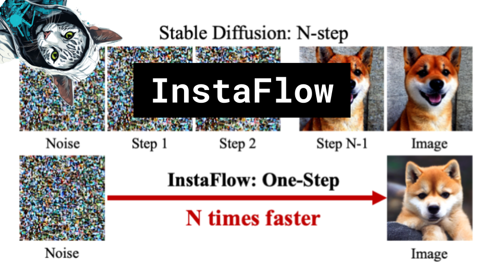

InstaFlow

Like 👍. Comment 💬. Subscribe 🟥.
🏘 Discord: https://discord.gg/pPAFwndTJd

**YouTube:** https://youtube.com/live/J4fm7YMZIOg

**X:** https://twitter.com/i/broadcasts/1MnxnpPPwLkGO

**Twitch:** https://www.twitch.tv/hu_po

# References

Paper
https://arxiv.org/pdf/2309.06380.pdf

Rectified Flow
https://arxiv.org/pdf/2209.14577.pdf

Neural ODE
https://arxiv.org/pdf/1806.07366.pdf

Consistency Flow
https://arxiv.org/pdf/2303.01469v1.pdf

Progressive Distillation
https://arxiv.org/pdf/2202.00512.pdf

Distillation
https://miro.medium.com/v2/resize:fit:936/1*8KqNtABnNXM527JK9UuBUQ.jpeg

GitHub 
https://github.com/gnobitab/InstaFlow

Starting script from Huggingface diffusers
https://github.com/huggingface/diffusers/blob/main/examples/text_to_image/train_text_to_image.py

Frechet Inception Distance (FID)
https://machinelearningmastery.com/wp-content/uploads/2019/06/Example-of-How-Increased-Distortion-of-an-Image-Correlates-with-High-FID-Score.png

https://www.catalyzex.com/_next/image?url=https%3A%2F%2Fai2-s2-public.s3.amazonaws.com%2Ffigures%2F2017-08-08%2F2c2e23c3051ffb5fccf3e73e834a33f96c37b778%2F2-Figure1-1.png&w=640&q=75

LPIPs
https://www.researchgate.net/profile/Abhijay-Ghildyal/publication/362300850/figure/fig2/AS:1182653306933290@1658977929587/LPIPS-framework-The-same-feature-extraction-network-AlexNet-is-used-to-extract-feature.png

https://torchmetrics.readthedocs.io/en/stable/image/learned_perceptual_image_patch_similarity.html

Forward Euler Method
https://x-engineer.org/wp-content/uploads/2018/10/Graphical-representation-of-Euler-integration-method.jpg

COCO Dataset
https://cocodataset.org/#explore

Latent Diffusion Model diagram
https://miro.medium.com/v2/resize:fit:1400/1*NpQ282NJdOfxUsYlwLJplA.png

More diffusion model diagram
https://scholar.harvard.edu/sites/scholar.harvard.edu/files/styles/os_files_xxlarge/public/binxuw/files/diffusion_schematics.png?m=1687747701&itok=g-Tcgz5S
