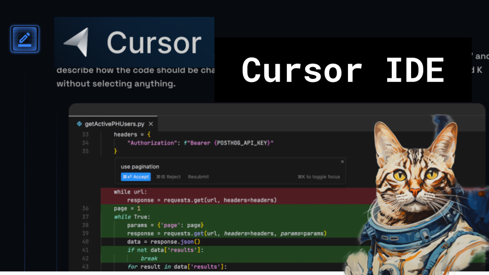

Cursor IDE for Python

Like 👍. Comment 💬. Subscribe 🟥.
🏘 Discord: https://discord.gg/pPAFwndTJd

**YouTube:** https://youtube.com/live/uvZBlufZHP4

**X:** https://twitter.com/i/broadcasts/1yNxaNbbLXWKj

**Twitch:** https://www.twitch.tv/hu_po

# References

https://www.cursor.so/

TODO ideas:

- try out all features https://www.cursor.sh/features
- add third servo
- refactor cv2 vs ffmpeg camera, which is least worst
- simplify openai api
- communicating between openai api in python and servos (ideally in C)
- OO for trajectories w/ properties like duration, speed, etc. __str__ for trajectories
- small gradio interface for rpi screen
- copy over discord bot