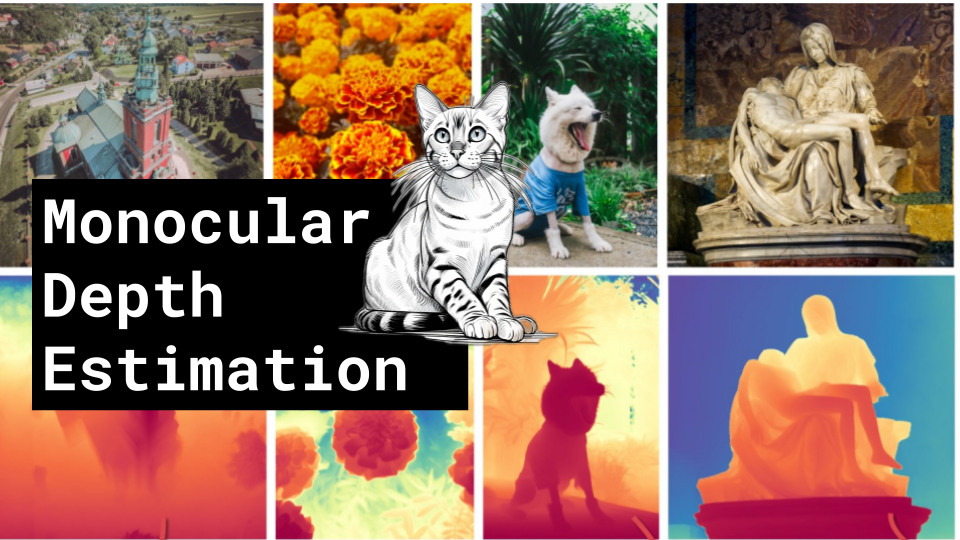

Monocular Depth Estimation

Like 👍. Comment 💬. Subscribe 🟥.
🏘 Discord: https://discord.gg/pPAFwndTJd

**YouTube:** https://youtube.com/live/WoiI_Pn9yHw

**X:** https://twitter.com/i/broadcasts/1ynJOyeEoLZKR

**Twitch:** https://www.twitch.tv/hu_po

# References

PatchFusion: An End-to-End Tile-Based Framework for High-Resolution Monocular Metric Depth Estimation
https://arxiv.org/pdf/2312.02284v1.pdf

Repurposing Diffusion-Based Image Generators for Monocular Depth Estimation
https://arxiv.org/pdf/2312.02145v1.pdf