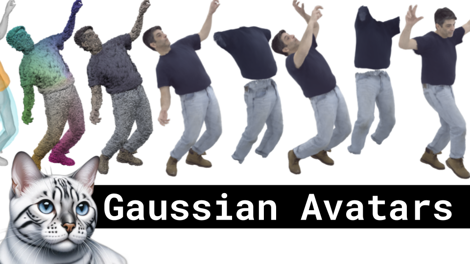

Gaussian Avatars,  Human Digitization, Story-to-Motion

Like 👍. Comment 💬. Subscribe 🟥.
🏘 Discord: https://discord.gg/pPAFwndTJd

**YouTube:**

**X:**

**Twitch:** https://www.twitch.tv/hu_po

# References

Drivable 3D Gaussian Avatars
https://arxiv.org/abs/2311.08581

Story-to-Motion: Synthesizing Infinite and Controllable Character Animation from Long Text
https://arxiv.org/pdf/2311.07446.pdf

Single-Image 3D Human Digitization with Shape-Guided Diffusion
https://arxiv.org/pdf/2311.09221.pdf