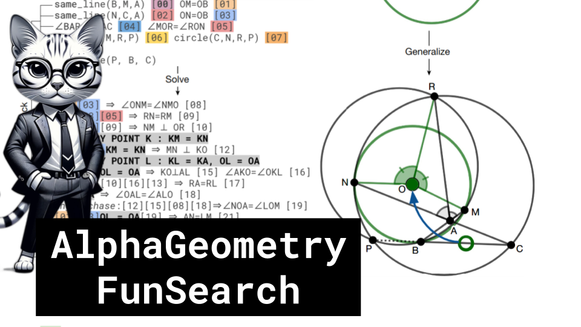

AlphaGeometry, FunSearch

Like 👍. Comment 💬. Subscribe 🟥.
🏘 Discord: https://discord.gg/pPAFwndTJd

**YouTube:** https://youtube.com/live/f1cCaJLGOYc

**X:** https://twitter.com/i/broadcasts/1rmGPMBAzLLJN

**Twitch:** https://www.twitch.tv/hu_po

# References

Solving olympiad geometry without human demonstrations
https://www.nature.com/articles/s41586-023-06747-5

Mathematical discoveries from program search with large language models
https://www.nature.com/articles/s41586-023-06924-6