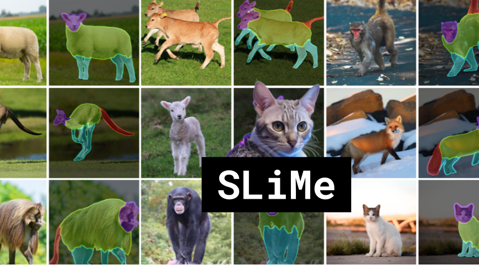

SLiMe

Like 👍. Comment 💬. Subscribe 🟥.
🏘 Discord: https://discord.gg/pPAFwndTJd

**YouTube:** https://youtube.com/live/qPLtyqa3hUw

**X:** https://twitter.com/i/broadcasts/1yNxaNbqaDWKj

**Twitch:** https://www.twitch.tv/hu_po

# References

https://arxiv.org/pdf/2309.03179.pdf

Latent Diffusion Model diagram
https://miro.medium.com/v2/resize:fit:1400/1*NpQ282NJdOfxUsYlwLJplA.png

More diffusion model diagram
https://scholar.harvard.edu/sites/scholar.harvard.edu/files/styles/os_files_xxlarge/public/binxuw/files/diffusion_schematics.png?m=1687747701&itok=g-Tcgz5S

Beyond Surface Statistics: Scene Representations in a Latent Diffusion Model
https://arxiv.org/abs/2306.05720

Transformer Diagram
https://i.stack.imgur.com/MJIyF.png

https://www.researchgate.net/publication/360353665/figure/fig3/AS:1151883624349697@1651641865803/Multi-head-attention-steps-The-example-consists-of-two-heads-and-the-input-sequence.ppm

Segment Anything
https://github.com/facebookresearch/segment-anything
