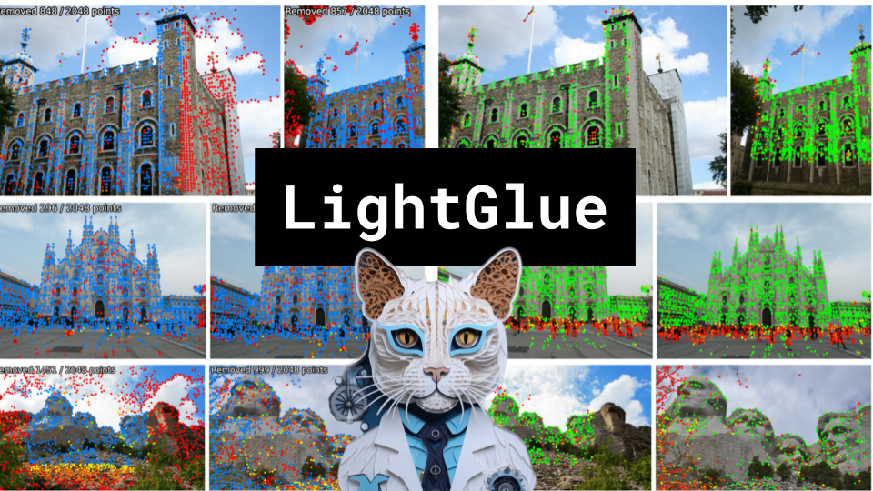

LightGlue

Like 👍. Comment 💬. Subscribe 🟥.
🏘 Discord: https://discord.gg/pPAFwndTJd

**YouTube:** https://youtube.com/live/LBFiKtUBHc0

**X:** https://twitter.com/i/broadcasts/1vOxwjbXVZgJB

**Twitch:** https://www.twitch.tv/hu_po

# References

Code
https://github.com/cvg/LightGlue

LightGlue: Local Feature Matching at Light Speed
https://arxiv.org/pdf/2306.13643.pdf

SuperGlue: Learning Feature Matching with Graph Neural Networks
https://arxiv.org/pdf/1911.11763.pdf

Quest 3 SLAM
https://twitter.com/hybridherbst/status/1712244271854608890

Gaussian Splats use COLMAP
https://github.com/graphdeco-inria/gaussian-splatting

SfM
https://www.youtube.com/watch?v=i7ierVkXYa8

SIFT
https://velog.io/@dusruddl2/Photogrammetry-8-1.-Visual-Features-Desciptors-SIFT-BRIEF-ORB

COLMAP uses SIFT
https://colmap.github.io/tutorial.html#feature-matching-and-geometric-verification

RoPE
https://www.youtube.com/watch?app=desktop&v=GQPOtyITy54
https://sh-tsang.medium.com/brief-review-roformer-enhanced-transformer-with-rotary-position-embedding-36f67a619442

Fourier Features
https://arxiv.org/pdf/2106.02795.pdf
https://chat.openai.com/share/ebfd8098-e8c9-40b3-936e-93765a85b667

MegaDepth
https://paperswithcode.com/dataset/megadepth

SuperPoint
https://arxiv.org/pdf/1712.07629.pdf

RANSAC
https://en.wikipedia.org/wiki/Random_sample_consensus
