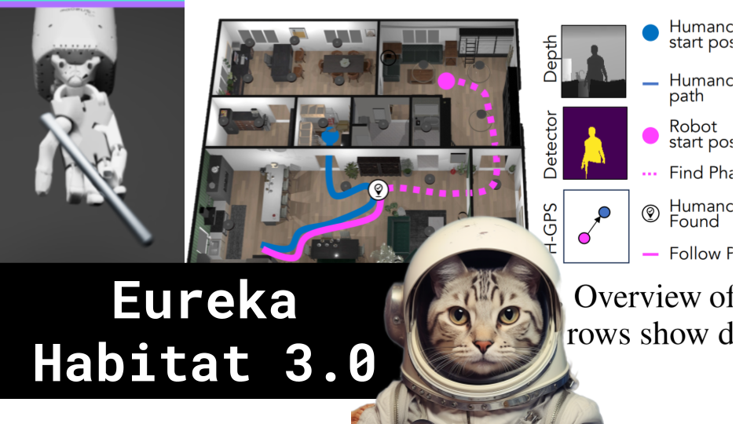

Eureka Habitat 3.0

Like 👍. Comment 💬. Subscribe 🟥.
🏘 Discord: https://discord.gg/pPAFwndTJd

**YouTube:** https://youtube.com/live/217NZ85rp-w

**X:** https://twitter.com/i/broadcasts/1YqGoDYoAZEJv

**Twitch:** https://www.twitch.tv/hu_po

# References

EUREKA: HUMAN-LEVEL REWARD DESIGN VIA CODING LARGE LANGUAGE MODELS
https://arxiv.org/pdf/2310.12931.pdf

HABITAT 3.0: A CO-HABITAT FOR HUMANS, AVATARS AND ROBOTS
https://ai.meta.com/static-resource/habitat3

MIMICGEN 
https://mimicgen.github.io/

Habitat 3.0
https://aihabitat.org/habitat3/
https://github.com/facebookresearch/habitat-lab/tree/v0.3.0

SMPL Humans
https://smpl-x.is.tue.mpg.de/

PPO explained by Abeel
https://youtu.be/KjWF8VIMGiY

Shadowhand
https://www.shadowrobot.com/dexterous-hand-series/
https://www.shadowrobot.com/blog/how-much-does-a-robot-hand-cost/

Voyager MMinecraft Paper
https://arxiv.org/abs/2305.16291

ISAAC sim
https://developer.nvidia.com/isaac-sim

English is the new programing language
https://twitter.com/karpathy/status/1617979122625712128

EMOJIs as blank tokens
https://github.com/hu-po/plai/blob/main/src/robot.py
