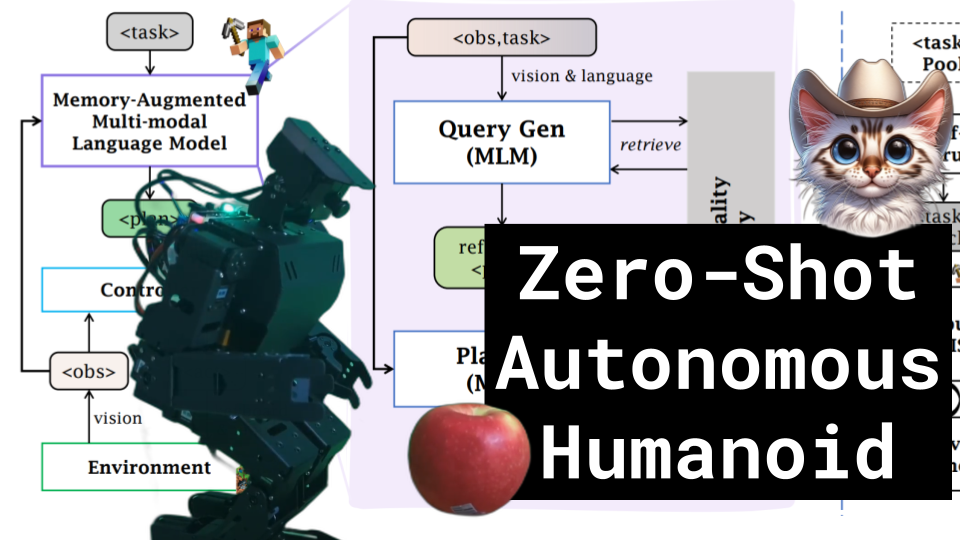

Zero-Shot Autonomous Humanoid

Like 👍. Comment 💬. Subscribe 🟥.
🏘 Discord: https://discord.gg/pPAFwndTJd

**YouTube:** https://youtube.com/live/bN9_ml4f05M

**X:** https://twitter.com/i/broadcasts/1RDGllBAXrMGL

**Twitch:** https://www.twitch.tv/hu_po

# References

how many fingers holding up
turn towards orange tube
communication via a txt file

LLM councils
RL concepts in language space
multi-turn dialogues
emojis as attention sinks

visualization tool

https://replicate.com/daanelson/motion_diffusion_model

hardware situation
igigi as a yoda backpack
additional batteries in dragged cart

open source vs closed source mode
api price comparisons

pet vs household assistant

https://github.com/hu-po/o

https://twitter.com/erichorvitz/status/1729854235443884385

Let’s Verify Step by Step
https://arxiv.org/pdf/2305.20050.pdf

On Bringing Robots Home
https://arxiv.org/pdf/2311.16098.pdf
