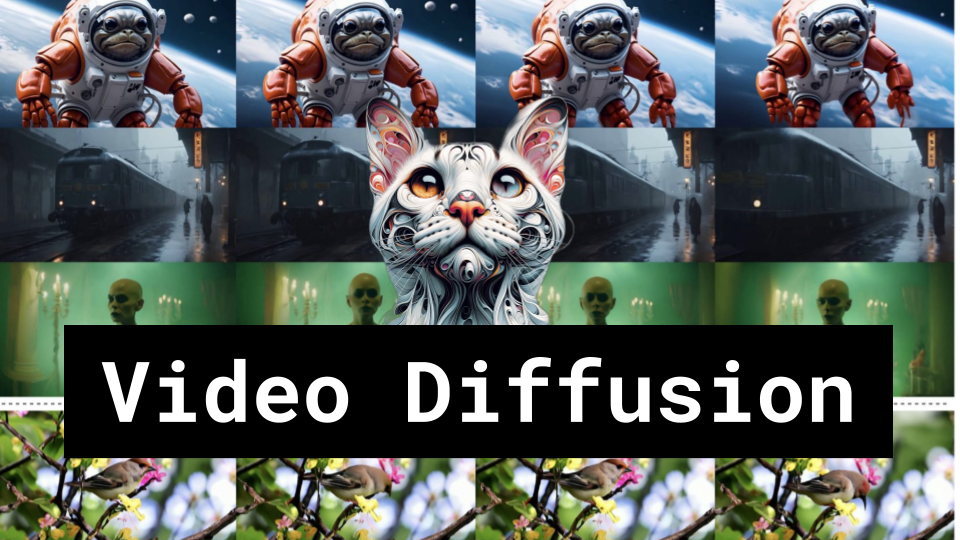

Video Diffusion

Like 👍. Comment 💬. Subscribe 🟥.
🏘 Discord: https://discord.gg/pPAFwndTJd

**YouTube:** https://youtube.com/live/zSC145iNzE4

**X:** https://twitter.com/i/broadcasts/1YpJkwPqbVNJj

**Twitch:** https://www.twitch.tv/hu_po

# References

Animate Anyone: Consistent and Controllable Image-to-Video Synthesis for Character Animation
https://arxiv.org/pdf/2311.17117.pdf

MagicAnimate: Temporally Consistent Human Image Animation using Diffusion Model
https://arxiv.org/pdf/2311.16498.pdf

Generative Rendering: Controllable 4D-Guided Video Generation with 2D Diffusion Models
https://arxiv.org/pdf/2312.01409.pdf

VideoBooth: Diffusion-based Video Generation with Image Prompts
https://arxiv.org/pdf/2312.00777.pdf

DreamVideo: Composing Your Dream Videos with Customized Subject and Motion
https://arxiv.org/pdf/2312.04433.pdf

AnimateZero: Video Diffusion Models are Zero-Shot Image Animators
https://arxiv.org/pdf/2312.03793.pdf

MotionCtrl: A Unified and Flexible Motion Controller for Video Generation
https://arxiv.org/pdf/2312.03641.pdf

Stable Video Diffusion: Scaling Latent Video Diffusion Models to Large Datasets
https://static1.squarespace.com/static/6213c340453c3f502425776e/t/655ce779b9d47d342a93c890/1700587395994/stable_video_diffusion.pdf

ControlNet
https://miro.medium.com/v2/resize:fit:1400/1*QzIcSiTTBMeqk0dh5KSfSQ.png
https://miro.medium.com/v2/resize:fit:1400/1*bc6KBvDABUTgw4GH8ashpA.png

LoRA
https://miro.medium.com/v2/resize:fit:299/1*BCs63SXaAu3NKqUaTLTH2g.png
