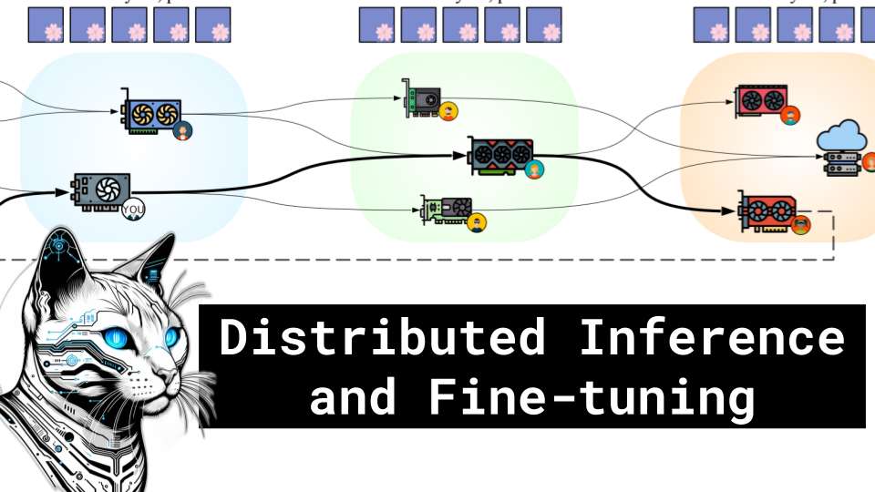

Distributed Inference and Fine-Tuning

Like 👍. Comment 💬. Subscribe 🟥.
🏘 Discord: https://discord.gg/pPAFwndTJd

**YouTube:** https://youtube.com/live/0RlAOvuqc_Q

**X:** https://twitter.com/i/broadcasts/1RDGllbEmNgGL

**Twitch:** https://www.twitch.tv/hu_po

# References

Distributed Inference and Fine-tuning of Large Language Models Over The Internet
https://arxiv.org/pdf/2312.08361.pdf

DiLoCo: Distributed Low-Communication Training of Language Models
https://arxiv.org/abs/2311.08105

Gradient Descent
https://imgur.com/a/Hqolp

Yandex
https://en.wikipedia.org/wiki/Yandex

GPU Clusters
https://www.researchgate.net/profile/Adrian-Castello/publication/280883404/figure/fig7/AS:668370026385410@1536363240083/rCUDA-cluster-configurations.ppm
https://www.digital-engineering-magazin.de/wp-content/uploads/gallery/gallery_de_2015_05_402_racks-7.png
https://blog.themvp.in/wp-content/uploads/2023/03/How-to-build-a-GPU-Cluster.jpg

All-reduce
https://www.mdpi.com/applsci/applsci-10-06717/article_deploy/html/images/applsci-10-06717-g001.png

Model, Data, Tensor, Pipeline Parallelism
https://miro.medium.com/v2/resize:fit:1400/1*OXtkG9ABtfIW-lCBkf5Yxg.png

Inefficiencies of Parallelism
https://huggingface.co/transformers/v4.9.2/_images/parallelism-gpipe-bubble.png

Big O notation
https://media.geeksforgeeks.org/wp-content/cdn-uploads/mypic.png
