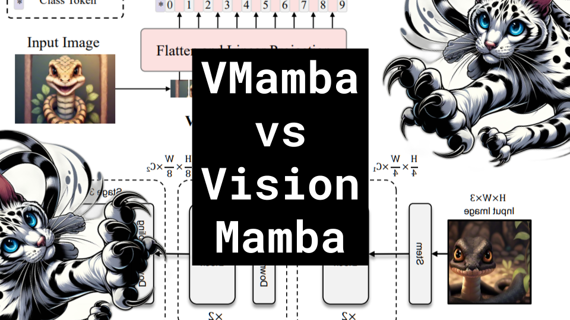

VMamba vs Vision Mamba

Like 👍. Comment 💬. Subscribe 🟥.
🏘 Discord: https://discord.gg/pPAFwndTJd

**YouTube:** https://youtube.com/live/RtHDu6kFPb8

**X:** https://twitter.com/i/broadcasts/1mrGmyLkWzQGy

**Twitch:** https://www.twitch.tv/hu_po

# References

Vision Mamba: Efficient Visual Representation Learning with Bidirectional State Space Model
https://arxiv.org/pdf/2401.09417.pdf

VMamba: Visual State Space Model
https://arxiv.org/pdf/2401.10166.pdf

ViT diagram
https://gowrishankar.info/blog/transformers-everywhere-patch-encoding-technique-for-vision-transformersvit-explained/architecture.png

CNN Receptive Field
https://theaisummer.com/static/490be17ee7f19b78003c3fdf5a6bbafc/83b75/receptive-field-in-convolutional-networks.png

Swin Transformer: Hierarchical Vision Transformer using Shifted Windows
https://arxiv.org/pdf/2103.14030.pdf

Training data-efficient image transformers & distillation through attention
https://arxiv.org/pdf/2012.12877v2.pdf

SiLU
https://paperswithcode.com/method/silu
