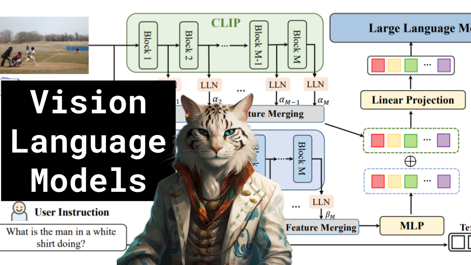

Vision Language Models: PaLI-3 and COMM

Like 👍. Comment 💬. Subscribe 🟥.
🏘 Discord: https://discord.gg/pPAFwndTJd

**YouTube:** https://youtube.com/live/446QYqELoIs

**X:** https://twitter.com/i/broadcasts/1MYGNobYLbyJw

**Twitch:** https://www.twitch.tv/hu_po

# References

FROM CLIP TO DINO: VISUAL ENCODERS SHOUT IN MULTI-MODAL LARGE LANGUAGE MODELS
https://arxiv.org/pdf/2310.08825v1.pdf

PALI-3 VISION LANGUAGE MODELS: SMALLER, FASTER, STRONGER
https://arxiv.org/pdf/2310.09199.pdf

DeepSpeed-VisualChat: Multi-Round Multi-Image Interleave Chat via Multi-Modal Causal Attention
https://arxiv.org/pdf/2309.14327.pdf

Qwen-VL: A Versatile Vision-Language Model for Understanding, Localization, Text Reading, and Beyond
https://arxiv.org/pdf/2308.12966.pdf

Sigmoid Loss for Language Image Pre-Training
https://arxiv.org/ftp/arxiv/papers/2303/2303.15343.pdf

Contrastive Loss
https://miro.medium.com/v2/resize:fit:1400/format:webp/1*E6UUEmxKp5ZTRgCRNbIP-g.png
https://www.baeldung.com/wp-content/uploads/sites/4/2022/02/representation-e1645470625256-1024x671.png

CLIP
https://openai.com/research/clip
https://arxiv.org/pdf/2103.00020.pdf

