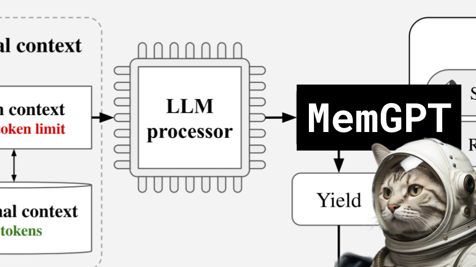

MemGPT

Like 👍. Comment 💬. Subscribe 🟥.
🏘 Discord: https://discord.gg/pPAFwndTJd

**YouTube:** https://youtube.com/live/BNJF7X3TFGU

**X:** https://twitter.com/i/broadcasts/1OdKrjregbyKX

**Twitch:** https://www.twitch.tv/hu_po

# References

MEMGPT: TOWARDS LLMS AS OPERATING SYSTEMS
https://arxiv.org/pdf/2310.08560.pdf
https://github.com/cpacker/MemGPT
https://memgpt.ai

SELF-RAG: LEARNING TO RETRIEVE, GENERATE, AND CRITIQUE THROUGH SELF-REFLECTION
https://arxiv.org/pdf/2310.11511.pdf

IN-CONTEXT PRETRAINING: LANGUAGE MODELING BEYOND DOCUMENT BOUNDARIES
https://arxiv.org/pdf/2310.10638.pdf

Instruction set architecture
https://en.wikipedia.org/wiki/Instruction_set_architecture

Memory Paging
https://en.wikipedia.org/wiki/Memory_paging

CPU Diagrams
https://www.baeldung.com/wp-content/uploads/sites/4/2021/05/x99-chipset-block-diagram-2016-rwd-1536x864-1.png
https://static.helpjuice.com/helpjuice_production/uploads/upload/image/8021/3260553/1687367636806-1624981831507-1624981831507.png
https://images.edrawsoft.com/articles/block-diagram-of-computer/8-block-diagram-of-computer.jpg
https://sheir.org/edu/wp-content/uploads/2017/03/computer-system.gif
