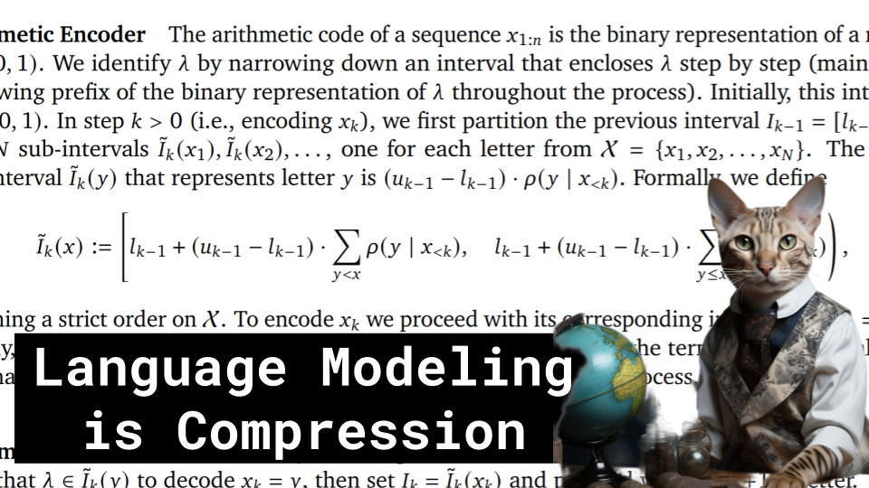

LLMs == Compression

Like 👍. Comment 💬. Subscribe 🟥.
🏘 Discord: https://discord.gg/pPAFwndTJd

**YouTube:** https://youtube.com/live/2D2uRvW9A3w?feature=share

**X:** https://twitter.com/i/broadcasts/1BdGYrjvzRAJX

**Twitch:** https://www.twitch.tv/hu_po

# References

https://arxiv.org/pdf/2309.10668.pdf

log base 2
https://upload.wikimedia.org/wikipedia/commons/8/81/Logarithm_plots.png

logarithm rules
https://www.chilimath.com/wp-content/uploads/2020/03/log-rules.gif

log likelihood
https://en.wikipedia.org/wiki/Likelihood_function#Log-likelihood

Shannon entropy w/ GPT
https://chat.openai.com/c/091a9b5b-add4-44bd-8eb4-d6319ca8a5b0

Cross-entropy vs negative log likelihood
https://towardsdatascience.com/cross-entropy-negative-log-likelihood-and-all-that-jazz-47a95bd2e81

Negative Log Likelihood (minimizing NNL == maximizing likelihood)
https://i.imgur.com/hU252jE.jpeg

