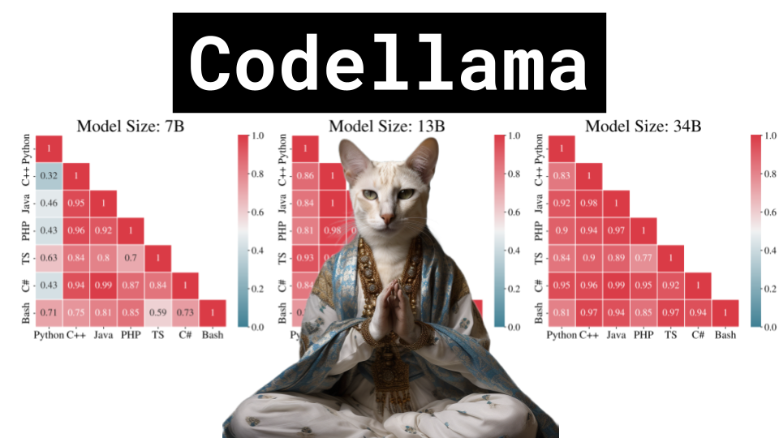

Codellama

Like 👍. Comment 💬. Subscribe 🟥.
🏘 Discord: https://discord.gg/pPAFwndTJd

**YouTube:**

**X:**

**Twitch:**

# Pre

Go through paper, kinda long so maybe just figures?
https://ai.meta.com/research/publications/code-llama-open-foundation-models-for-code/

duplicate space so ready to run live
https://huggingface.co/spaces/codellama/codellama-13b-chat
https://huggingface.co/pharaouk/unnatural_codellama_34B

Repo, install and play around with
https://github.com/facebookresearch/codellama

generate leetcode problem with ChatGPT, get codellama to solve it, and vice versa

generates stackoverflow usernames
https://twitter.com/1littlecoder/status/1695037623289389060?t=-kRAQzOpVBjFBLkca5uX5Q&s=19

hacks theta rope param for longer context
https://twitter.com/b_roziere/status/1694732384938217474?t=LHb2-jZYP2ByUFuoksnHag&s=19

long vs short context are competing objectives
https://twitter.com/suchenzang/status/1694740351851131312?t=OCtb6gs9VA_3mZMPQPv_zQ&s=19

more on RoPE embeddings
https://www.reddit.com/r/LocalLLaMA/comments/14lz7j5/ntkaware_scaled_rope_allows_llama_models_to_have/
https://blog.eleuther.ai/rotary-embeddings/
https://youtu.be/o29P0Kpobz0?si=ZM8bnSYvEYpRk8ZI&t=450

KV Cache
https://youtu.be/80bIUggRJf4?si=fEJvkdGxaBvazXuj&t=156

# Post
