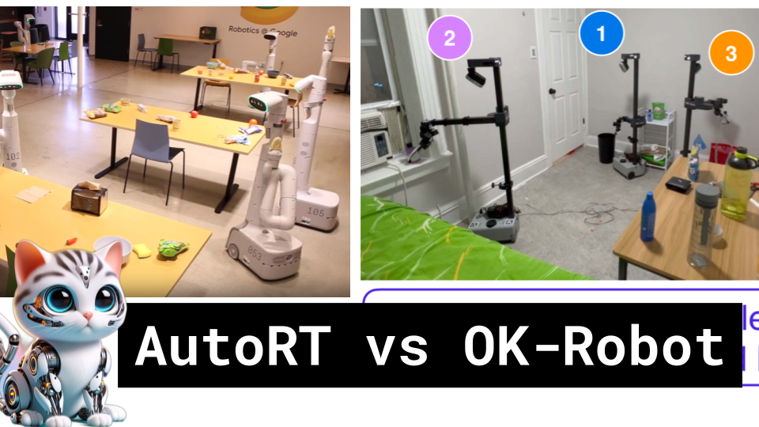

AutoRT vs OK-Robot

Like 👍. Comment 💬. Subscribe 🟥.
🏘 Discord: https://discord.gg/pPAFwndTJd

**YouTube:** https://youtube.com/live/PFqGpDLgZz8

**X:** https://twitter.com/i/broadcasts/1mrGmylzrXNGy

**Twitch:** https://www.twitch.tv/hu_po

# References

AUTORT: EMBODIED FOUNDATION MODELS FOR LARGE SCALE ORCHESTRATION OF ROBOTIC AGENTS
https://arxiv.org/pdf/2401.12963.pdf

OK-Robot: What Really Matters in Integrating Open-Knowledge Models for Robotics
https://arxiv.org/pdf/2401.12202.pdf

SpatialVLM: Endowing Vision-Language Models with Spatial Reasoning Capabilities
https://arxiv.org/pdf/2401.12168.pdf