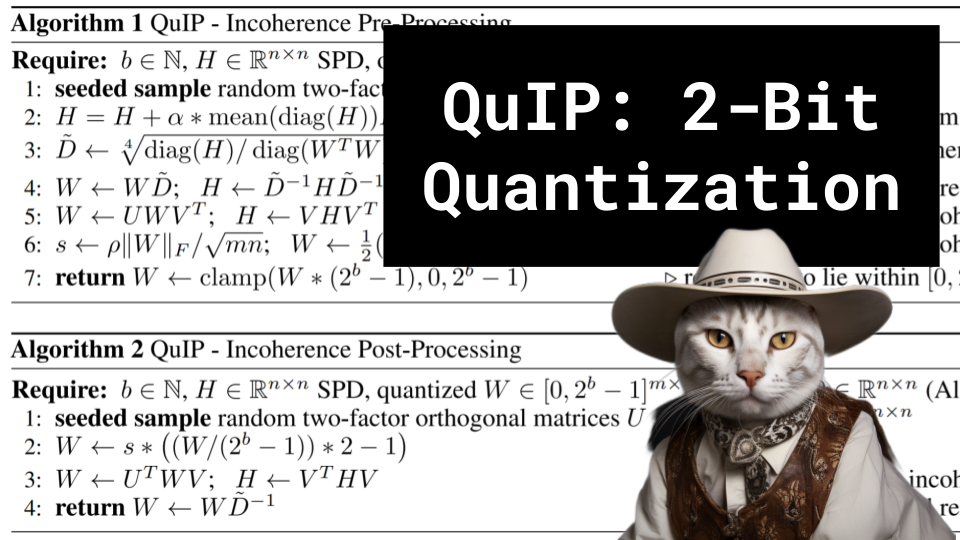

QuIP: 2-Bit Quantization

Like 👍. Comment 💬. Subscribe 🟥.
🏘 Discord: https://discord.gg/pPAFwndTJd

**YouTube:** https://www.youtube.com/live/6wEVz0wkhCM

**X:** https://twitter.com/hupobuboo/status/1695526529768558994

**Twitch:** https://www.twitch.tv/hu_po

# References

Main Paper link
https://arxiv.org/pdf/2307.13304.pdf

Adaptive rounding
https://arxiv.org/pdf/2004.10568.pdf

GPT on Taylor Series for approximating loss
https://chat.openai.com/share/fca58356-9d2a-49e5-a896-b4067d625bc8

QLoRA
https://arxiv.org/pdf/2305.14314.pdf

Older video on Quantization
https://www.youtube.com/watch?v=KASuxB3XoYQ

Section 6 (Setup), Everything built from GPTQ
https://github.com/IST-DASLab/gptq

Orthogonal matrices
https://youtu.be/IGBm-gZryVI?si=cD9vbtCw6GHgJRkf
https://youtu.be/S0uzwDKqnsw?si=GDEVCic5xyWfCEC2

On incoherence
https://en.wikipedia.org/wiki/Mutual_coherence_(linear_algebra)

Bard Convo
https://g.co/bard/share/b1e9b8eaba81

GPT Convo
https://chat.openai.com/share/ec6e4742-38b4-4e35-9330-4ade2e5de92d

Possible idea worth co-marinating?
https://oft.wyliu.com/static/files/oft_v1.pdf

