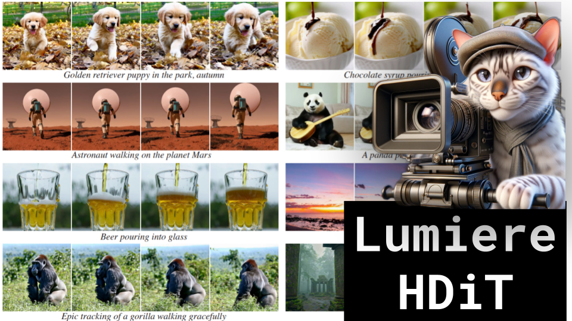

Lumiere, HDiT

Like 👍. Comment 💬. Subscribe 🟥.
🏘 Discord: https://discord.gg/pPAFwndTJd

**YouTube:** https://youtube.com/live/WskSQvJvlxU

**X:** https://twitter.com/i/broadcasts/1OwxWYbpdjDGQ

**Twitch:** https://www.twitch.tv/hu_po

# References

Lumiere: A Space-Time Diffusion Model for Video Generation
https://arxiv.org/pdf/2401.12945.pdf

Scalable High-Resolution Pixel-Space Image Synthesis with Hourglass Diffusion Transformers
https://arxiv.org/pdf/2401.11605.pdf

MultiDiffusion: Fusing Diffusion Paths for Controlled Image Generation
https://arxiv.org/pdf/2302.08113.pdf

CNN Visualization
https://adamharley.com/nn_vis/cnn/3d.html

Attention Visualization
https://bbycroft.net/llm

