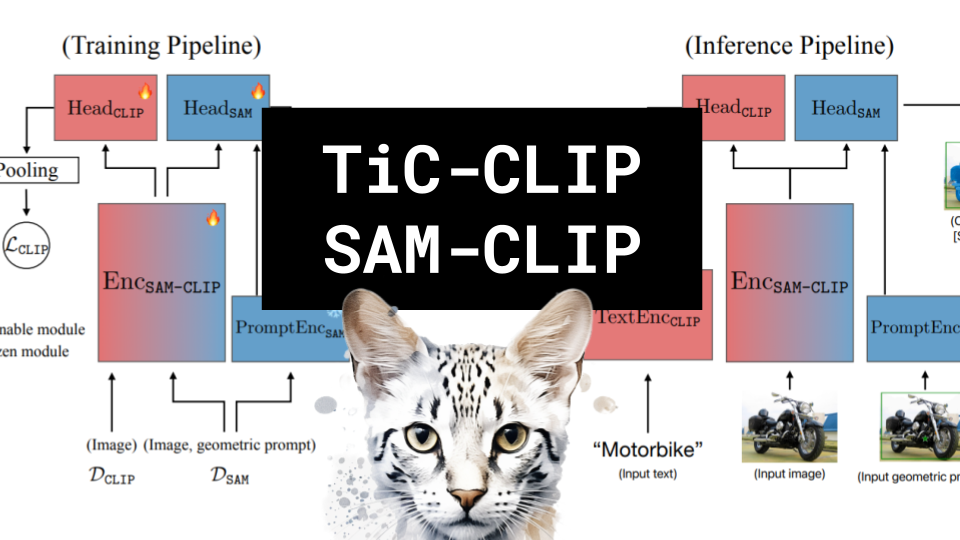

TiC-CLIP SAM-CLIP

Like 👍. Comment 💬. Subscribe 🟥.
🏘 Discord: https://discord.gg/pPAFwndTJd

**YouTube:** https://youtube.com/live/qpCqtPV7aeo

**X:** https://twitter.com/i/broadcasts/1BRJjPbmZWoKw

**Twitch:** https://www.twitch.tv/hu_po

# References

SAM-CLIP: MERGING VISION FOUNDATION MODELS TOWARDS SEMANTIC AND SPATIAL UNDERSTANDING
https://arxiv.org/pdf/2310.15308.pdf

TIC-CLIP: CONTINUAL TRAINING OF CLIP MODELS
https://arxiv.org/pdf/2310.16226.pdf

CLIP Models
https://twitter.com/gabriel_ilharco/status/1717541859093098842/photo/1

SAM
https://github.com/facebookresearch/segment-anything

BYOL
https://paperswithcode.com/method/byol
https://miro.medium.com/v2/resize:fit:816/1*1Uz_noYE71KnqFf718fqnA.png

Distillation
https://miro.medium.com/v2/resize:fit:936/1*8KqNtABnNXM527JK9UuBUQ.jpeg

OpenCLIP
https://github.com/mlfoundations/open_clip/tree/main

Focal Loss
https://pytorch.org/vision/main/_modules/torchvision/ops/focal_loss.html
https://openaccess.thecvf.com/content_ICCV_2017/papers/Lin_Focal_Loss_for_ICCV_2017_paper.pdf

DICE
https://i.stack.imgur.com/OsH4y.png

YFCC15M
https://huggingface.co/datasets/Ziyang/yfcc15m/viewer/default/train

Jim Fan on better captions
https://twitter.com/DrJimFan/status/1718282480539881497
